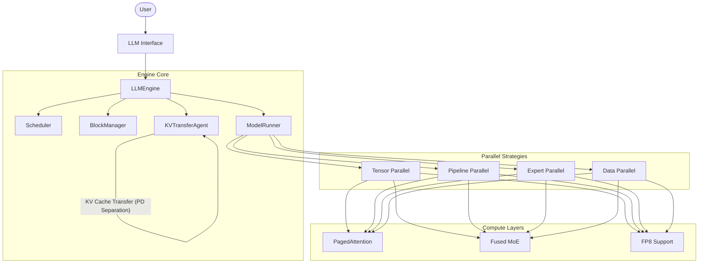

# Nano-vLLM

A lightweight LLM Inference implementation built from scratch, designed for high performance and readability.

## 🏗️ System Architecture

Nano-vLLM 遵循模块化设计，核心组件包括：

- **LLM Engine**: 系统的核心控制器，负责协调调度器、内存管理器和模型执行器。
- **Scheduler**: 实现了 Continuous Batching，根据 GPU 资源动态调度推理任务。
- **BlockManager**: 负责 PagedAttention 的内存管理，将 KV Cache 划分为物理块进行高效复用。
- **ModelRunner**: 封装了模型的前向计算逻辑，支持 CUDA Graph 加速和分布式并行。
- **KVTransferAgent**: 负责分布式节点间的 KV Cache 传输，支持 Prefill 和 Decode 节点分离部署。
- **Parallel Strategies**: 集成 TP, PP, EP 等多种并行策略，支持超大规模模型分布式推理。
- **Layer-based Models**: 模型实现高度复用基础算子库（Layers），支持快速接入新模型。



## 🌟 Key Features

- 🚀 **High Performance**:
    - [x] **Continuous Batching**: 极大地提升了吞吐量。
    - [x] **PagedAttention**: 优化 KV Cache 内存分配，减少碎片。
    - [x] **CUDA Graph**: 消除 CPU 侧发射开销，提升小 batch 性能。
    - [x] **Chunked Prefill**: 优化长文本预填充阶段的性能。
- 🔧 **Distributed Inference**: 
    - 支持 等多种并行策略
        - [x] **Tensor Parallel (TP)**
        - [ ] **Pipeline Parallel (PP)**
        - [x] **Expert Parallel (EP)**
        - [ ] **Data Parallel (DP)** 
    - **PD 分离 (Prefill/Decode Separation)**: 支持将预填充和解码任务部署在不同节点。
        - [x] Mooncake式自定义接口
- 💎 **Precision & Quantization**:
    - [x] 原生支持 **FP8** 精度推理，降低显存占用并加速计算。
- 🧩 **Optimized Kernels**:
    - [x] **Fused MoE**: 高效的 MoE 算子实现。
    - [x] **Prefix Caching**: 自动缓存公共前缀，加速多轮对话。

## 📚 Supported Models

目前已支持以下模型系列：
- **Qwen 系列**: 
    - [x] Qwen2
    - [x] Qwen3 (0.6B to 30B+)
    - [x] Qwen3-MoE

- **DeepSeek 系列**: DeepSeek-V3 (支持高性能推理)

## 🛠️ Quick Start

### Installation

```bash
git clone https://github.com/zkkython/nano-vllm.git
pip install -e .
```

### Usage Example

```python
from nanovllm import LLM, SamplingParams

# 初始化模型，支持多 GPU TP 并行
llm = LLM(
    model="/path/to/your/model",
    tensor_parallel_size=1,
    enforce_eager=True,
    gpu_memory_utilization=0.8
)

# 设置采样参数
sampling_params = SamplingParams(
    temperature=0.7,
    top_p=0.9,
    max_tokens=512
)

# 准备 Prompt
prompts = ["你好，请介绍一下你自己。", "如何评价 Nano-vLLM 的设计？"]

# 生成结果
outputs = llm.generate(prompts, sampling_params)

for output in outputs:
    print(f"Generated text: {output['text']}")
```


## 🗺️ Project Structure

```text
nanovllm/
├── engine/          # 核心引擎 (Scheduler, BlockManager, Runner, KVTransfer)
├── layers/          # 基础算子库 (Attention, Linear, MoE, FP8)
├── models/          # 具体模型定义 (Qwen, Llama, DeepSeek)
├── weight_mappings/ # 权重加载映射
└── utils/           # 分布式通信与工具类
```


